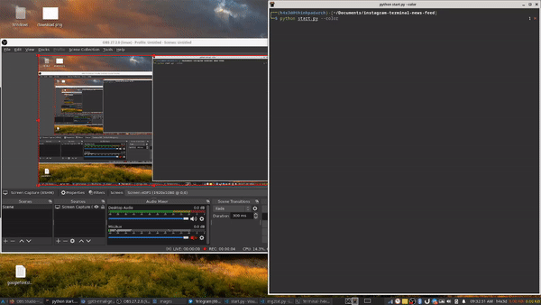
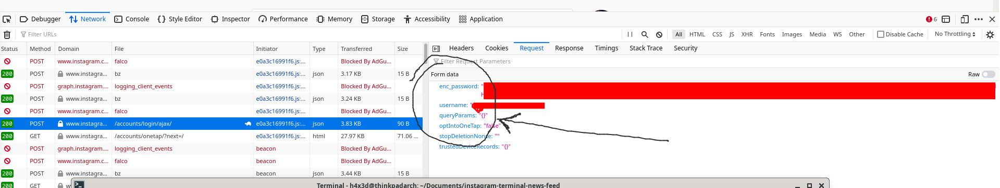

# Instagram Terminal Feed
#### With Color
<p align="center">

</p>

#### Without Color (Stealth Mode - Recommended using it during work :smirk:)
<p align="center">

</p>

### I came across this abandoned repo, and I said lets add some real color to it

#### Last working date Feb 2022

## What is this?
Sometimes checking your instagram during work is kind of strange, so why not check your instagram inside your terminal?
OK... I know checking this during work is still strange... :expressionless:
To be honest, I did this just for pure fun.
Please don’t forget to star this repo if you liked it!! :wink::wink:

## Getting Started

## Use kitty terminal to run this script

To install kitty on arch linux you can 

`sudo pacman -S kitty`


#### Installation
```
pip3 install -r requirements.txt
```

##### Get the enc_password for user authorization manually from the networks tab by logging into instagram as shown below



After pip installing run the below:
```
# Without Color
python3 start.py

# With Color
python3 start.py --color
```

Just that easy!! :sunglasses:

## Updates
* 2FA implemented (2018.03.31)

## Note
For the username and password part, I promise you it is safe even if you save it. The username/password will only be saved locally in the file called `credential.json`. You can also just don't save it which is the default option. 

You can check this out in the source code. :innocent:

## License

This project is licensed under the MIT License - see the [LICENSE](LICENSE) file for details

## Acknowledgments
* Thanks to [racega](https://github.com/rarcega/instagram-scraper) for inspiring me for the login functions
* Thanks to [nilesr](https://github.com/nilesr/braille-art) for the printing to ascii part
* Thanks to [hit9](https://github.com/hit9/img2txt) for the color printing to ascii part
* Thanks to [pixcat](https://github.com/mirukana/pixcat) for pixcat library